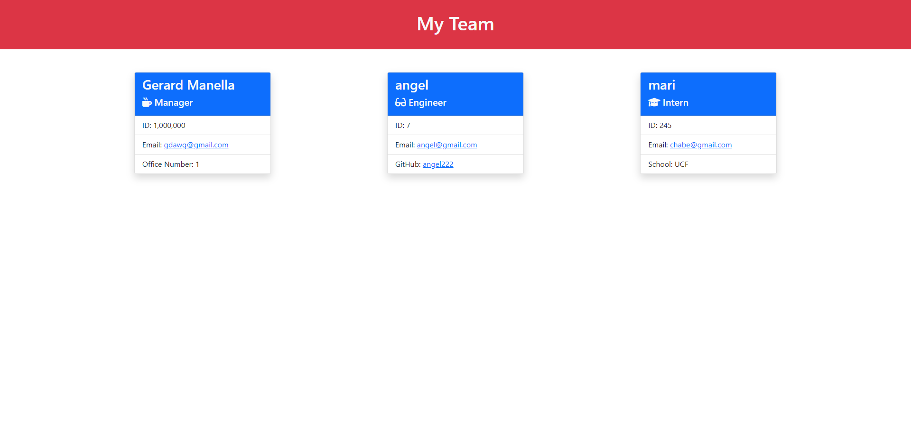

# Team Profile Generator

## Summary 
This a command line application that helps you make a team profile webpage that shows all of their team members including Managers, Engineers and Interns. The generator starts off by asking you what role your team member fulfills and then it'll ask you a series of questions like the team members name, email and id. And depending on the role it'll ask you a different fourth question. For Manager it will ask for their office number, for Engineer it will ask for their Github username, and for the inter it will ask for the school they attend. Afterwards it will create an HTML file located in the dist folder.

## Technologies
- Javascript - 100%
- Node.js 

## installation
Simply click on the code button and download it as a zip and once you're in the command line input 
```
npm install
```

## Walkthrough Video
click the link to see the video: https://drive.google.com/file/d/1OQOZcUxrDxUkEixC93-R2RUUxS6huPzF/view
## Code Breakdown
since this application has a lot of different files, classes and functions I'm going to breakdown each object separately to keep everything neat

- ### Employee class
    The Employee class consist of a constructor with a name, id, email and role properties that are defined by the users prompt through parameters, except the role property which is defaulted to Employee. The class has a getName(), gitId(), getEmail() and getRole() methods, that simply return the different properties of the class. It was also tested using Jest, the test consist of 2 test one to test if the object is created and has the properties I input through parameters. The Employee class is also the parent class for all the other classes.

- ### Manager class
    The Manager class extends that Employee class and it inherits all of its parents property including the role, which it overwrites to have a value of "Manager" instead of "Employee". the Manager also has an officeNumber property. it also has the getOfficeNumber() methods that like its parent returns its officeNumber property.

- ### Engineer Class
    The Engineer class also extends the Employee class. Since it works the same has the Manager class it also has to overwrite the Role property and change its value to "Engineer". It's unique property is the github property that is return when the getGithub() method is used.

- ### Intern class 
    Like the previous two classes the intern class extends and inherits the Employee class, and it overwrites the role property value to "Intern". It's unique property is the school thats returned when using the getSchool() method.

- ### App class
    the App class brings everything together including the Employee class and it all of its children and the generate-page.js function. The constructor is made up of two arrays and a method. The first array is the "employees" array this will hold all of the employees the user adds and the "employeePrompt" holds the inquirer.prompt questions. 3 of the questions have a "when" method that checks to see if the "role" object was a "Manager", "Engineer" and "Intern" value respectively, and depending on that value a different question will be asked. The class also has the run() method that does a few very important things. First it calls inquirer and passes the "employeePrompt" array as a parameter and then it runs a switch statement that takes the inputs from the user and uses cases to  create a new object using one of the 3 child classes and pushes it back to the "employees" array at the top of the class. After the switch statement, an if statement checks if the user wants to input a new and employee and if so it triggers the run() method and if not it uses the node fs method to write an HTML file using generateHTML function, the data is sent using the "employees" array as a parameter.

- ### generate-page.js
    This file consist of the employeeCard() function that returns the HTML. The function maps the array that was passed through it, to a switch statement that calls on the getRole() method the array objects have to filter it to the three different roles. Once filtered the three cases return a literal that holds the HTML. At the bottom theres another literal that uses the employeeCards() function to populate its main section.

- ### index.js
    this file consist of only 3 lines of code the first calls in the App class. The second makes a new object, and the third uses the App class's run() method.

## Sample Page Screenshot
